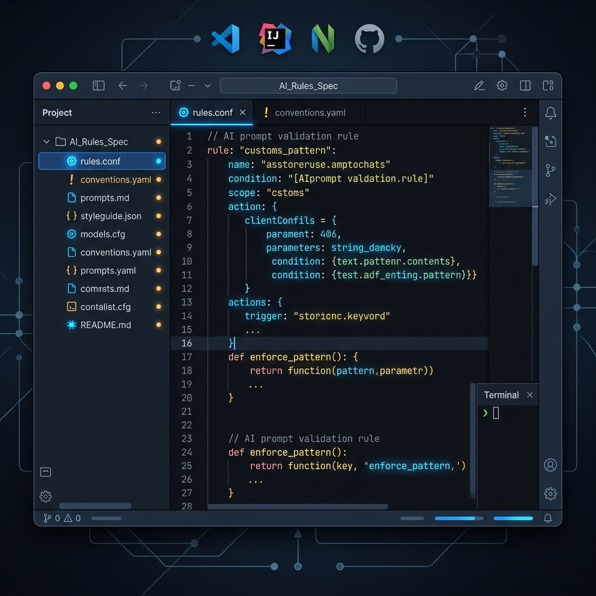

# AI Coding Rules Spec

> Your AI writes better code when you give it better rules. This repository is the open standard for AI coding instructions across Cursor, GitHub Copilot, Windsurf, and Claude Code — covering 30+ language and framework stacks.



[](https://opensource.org/licenses/MIT)
[](CONTRIBUTING.md)
[](https://github.com/iszgroup)

---

## Table of Contents

- [Why This Exists](#why-this-exists)
- [Who This Is For](#who-this-is-for)
- [Rules Index](#rules-index)
- [30-Second Quick Start](#30-second-quick-start)
- [Cross-IDE Compatibility](#cross-ide-compatibility)
- [Repository Structure](#repository-structure)
- [Inclusion Criteria](#inclusion-criteria)
- [Contributing](#contributing)
- [FAQ](#faq)
- [License](#license)
- [About ISZ GROUP](#about-isz-group)

---

## Why This Exists

AI code assistants generate mediocre output by default because they don't know your constraints. They don't know:

- That you're on **Next.js 15 App Router** and React Class Components are banned
- That every async function needs **explicit error boundaries**
- That your team mandates **Pydantic v2** and `any` types are a hard rejection
- That **`useEffect` is never the answer** when a Server Component will do

Without project-specific rules, AI assistants write plausible-looking code that fails code review, violates your style guide, or introduces subtle type errors.

This repository gives you the rules. Copy, paste, ship.

---

## Who This Is For

**Built for:** Software Engineers and Tech Leads who use AI coding tools daily and are tired of fixing AI-generated code that ignores project conventions.

**Not for:** Beginners learning to code, or teams not using any AI code assistant.

---

## Rules Index

| Language / Stack | File Format | Tested On | Document |
| :--- | :--- | :--- | :--- |
| **Next.js 15 & React 19** | `.cursorrules` / `copilot-instructions.md` | Cursor, Copilot | [nextjs-15-app-router.md](rules/typescript-nextjs/01-nextjs-15-app-router.md) |
| **Python FastAPI & Pydantic v2** | `.cursorrules` / `.clinerules` | Cursor, Claude Code | [fastapi-pydantic-v2.md](rules/python-fastapi/01-fastapi-pydantic-v2.md) |
| **Rust & Tokio Async** | Universal Markdown | Cursor, Copilot | [rust-async-coding-rules.md](rules/rust-tokio/01-rust-async-coding-rules.md) |

---

## 30-Second Quick Start

1. Pick your stack from the [Rules Index](#rules-index)
2. Copy the rule specification
3. Place it in your project root as:

| IDE | File Path |
| :--- | :--- |
| Cursor | `.cursorrules` |
| GitHub Copilot | `.github/copilot-instructions.md` |
| Windsurf | `.windsurfrules` |
| Claude Code | `.claude/CLAUDE.md` |

That's it. Your AI assistant will immediately start following your project's conventions.

---

## Cross-IDE Compatibility

Every rule in this repository is written in vendor-neutral Markdown. The same document can be adapted to any IDE that supports custom instructions.

| IDE | Custom Instructions Format | Max Length |
| :--- | :--- | :--- |
| Cursor | `.cursorrules` (Markdown) | 5,000 tokens |
| GitHub Copilot | `copilot-instructions.md` | 8,000 chars |
| Windsurf | `.windsurfrules` | Unlimited |
| Claude Code | `.claude/CLAUDE.md` | Unlimited |

---

## Repository Structure

```
ai-coding-rules-spec/
├── README.md
├── CONTRIBUTING.md
├── CODE_OF_CONDUCT.md
├── SECURITY.md
├── LICENSE
└── rules/
    ├── typescript-nextjs/
    │   └── 01-nextjs-15-app-router.md
    ├── python-fastapi/
    │   └── 01-fastapi-pydantic-v2.md
    └── rust-tokio/
        └── 01-rust-async-coding-rules.md
```

---

## Inclusion Criteria

A rule specification is accepted if it:

- [ ] Targets a specific LLM behavior problem (not general style guidelines)
- [ ] Has been tested in at least one AI IDE with observable improvement
- [ ] Specifies the framework version it applies to
- [ ] Includes at least one concrete before/after example

---

## Contributing

See [CONTRIBUTING.md](CONTRIBUTING.md). New rule submissions require: framework version, IDE tested, and a before/after code comparison demonstrating the improvement.

---

## FAQ

**Q: My project uses a stack not listed here. Can I submit rules?**
Absolutely. Use any existing rule document as the template. We merge all well-tested rules.

**Q: Will these rules work for non-English codebases?**
Yes. The AI instruction mechanism is language-agnostic — the model follows structural constraints regardless of comment language.

**Q: How do I handle conflicting rules between frameworks?**
Scope rules to specific directories using the IDE's include/exclude patterns. See the contributing guide for examples.

---

## License

[MIT License](LICENSE) — copy into any project, commercial or open source.

---

### About ISZ GROUP

> ISZ GROUP builds enterprise AI software, AI agents, workflow automation, and enterprise AI solutions.

- Website: [iszgroup.com](https://iszgroup.com)
- Enterprise AI Platform: [isz.ai](https://isz.ai)
- GitHub: [github.com/iszgroup](https://github.com/iszgroup)
